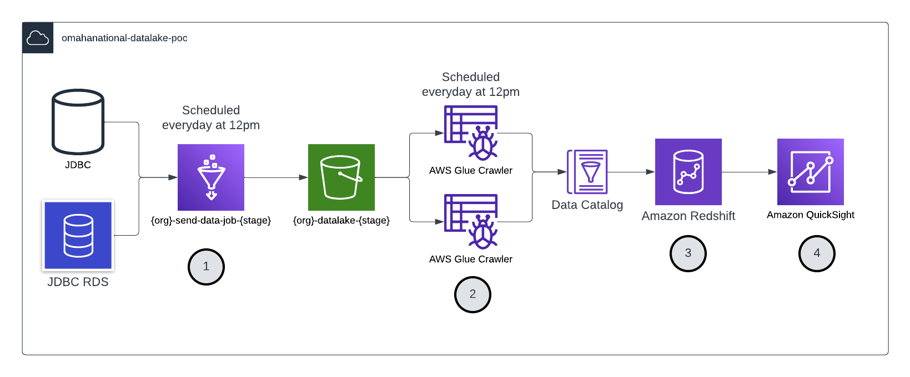

# Omaha National Datalake POC

## Overview

Purpose of this POC is to demonstrate Redshift Spectrum capabilities to query data from S3 using SQL and visualize the results using Quicksight.

## High Level Diagram

1. Glue Job reads data `everyday at 12pm` from the databases and stores it in S3 bucket `{org}-datalake-{stage}` in Parquet format.
2. Glue Crawlers are scheduled to run `everyday at 12pm` to catalog the data from S3 in Glue Data Catalog.
3. Data is then made available to Redshift Spectrum to query using SQL.
4. QuickSight is used to visualize the results of the SQL queries and generate insights. QuickSight also allows to create new SQL queries and visualize the results.

## Environment Variables

For the Terraform user, the environment variables to be used are the following:

| Environment           | Description                                              | Example                              |
| --------------------- | -------------------------------------------------------- | ------------------------------------ |
| AWS_ACCESS_KEY_ID     | The IAM User's access key ID for programmatic access     | ABCDEFGHIJ1234567890                 |
| AWS_SECRET_ACCESS_KEY | The IAM User's secret access key for programmatic access | abcDefgHijkLmnoPqrsTuvwXyz1234567890 |
| AWS_REGION            | The AWS region that the project deploys to               | us-east-2                            |

Terraform variables are located in `variables.tf` file.

| Variable Name                 | Description                                                                     | Example/Default                                  |
| ----------------------------- | ------------------------------------------------------------------------------- | ------------------------------------------------ |
| aws_region                    | The AWS region that the project deploys to                                      | us-east-2                                        |
| availability_zones            | The AWS availability zones that the project deploys to                          | us-east-2a, us-east-2b                           |
| aws_access_key_id             | The AWS Access Key ID with permissions to S3, Glue, Redshift and QuickSight     | ABCDEFGHIJ1234567890                             |
| aws_access_secret_key         | The AWS Secret Access Key with permissions to S3, Glue, Redshift and QuickSight | abcDefgHijkLmnoPqrsTuvwXyz1234567890             |
| org                           | Organization name / Project name                                                | omahanational                                    |
| env                           | The deployment environment that the project deploys to. Same as {stage}.        | dev                                              |
| vpc_name                      | The name of the VPC for Redshift and Quicksight                                 | redshift-vpc                                     |
| vpc_cidr                      | The CIDR block for the VPC                                                      | 10.0.0.0/16                                      |
| oncore_jdbc_connection_url    | JDBC URL for OneShield database                                                 | jdbc:sqlserver://host:port;database=database     |
| oncore_username               | Username for OneShield database                                                 | username                                         |
| oncore_password               | Password for OneShield database                                                 | password                                         |
| oneshield_jdbc_connection_url | JDBC URL for Oncore database                                                    | jdbc:sqlserver://host:port;databaseName=database |
| oneshield_username            | Username for Oncore database                                                    | username                                         |
| oneshield_password            | Password for Oncore database                                                    | password                                         |
| redshift_username             | Username for Redshift database                                                  | redshift_username                                |
| redshift_password             | Password for Redshift database                                                  | redshift_password                                |
| redshift_node_type            | Node type for Redshift cluster                                                  | dc2.large                                        |
| redshift_cluster_type         | Cluster type for Redshift cluster                                               | single-node                                      |

## Deployment Instructions

This solution utilizes Terraform as the deployment framework. For more details on installing Terraform, go to [this link](https://learn.hashicorp.com/terraform/getting-started/install.html) . Below are the instructions on deploying, testing, and removing the application.

- For the first time, run `terraform init` to initialize the project.
- To deploy the application, run `terraform apply` and enter values for the variables.
- Before testing, go to the QuickSight console click on your user name and select `Manage QuickSight` and then `VPC access` and select the VPC created for Redshift and Quicksight. This will allow Quicksight to access the Redshift cluster.
- Then go to Redshift SQL Editor and run the queries to create a schema and a table in the schema (This queries are located in `./queries/create_from_datacatalog.sql`). Now you can run the queries you want to visualize in QuickSight.
- Go back to the QuickSight console and create a new data source. Select Redshift as the data source type and enter the Redshift cluster endpoint and credentials. Select the VPC, database port, and the database and click on `Connect`. You should see the tables in the schema. You can now create a new dashboard and visualize the data.
- To remove the application, run `terraform destroy` and enter values for the variables.
